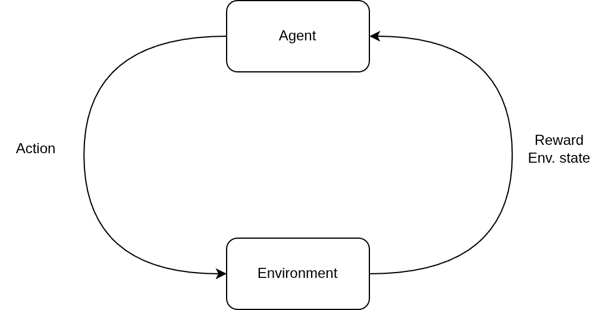
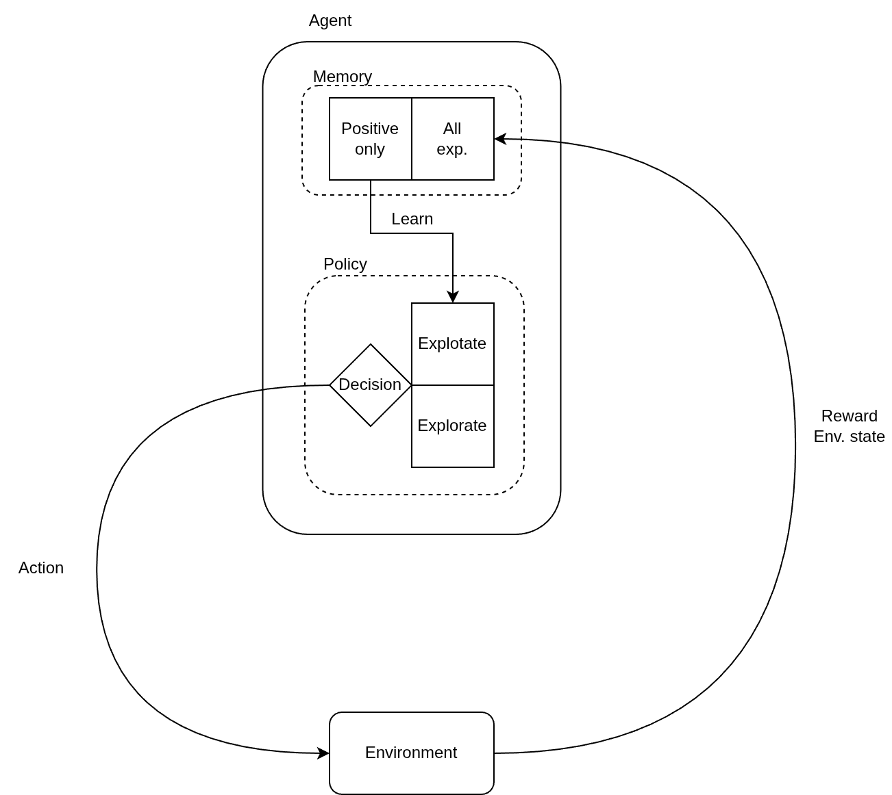

# Introduction to Reinforcement learning without math overhead

This project is part of article on [habr.com](https://habr.com/ru/companies/cinimex/articles/1050296/)

## Project structure

Directories:
```text
__target/           # pre-train model files, models in work demostration video records
doc/                # current documentation
src/                # project source code
```

Files:
```text
src/main.py         # exacutable project file
src/config.py       # project configuration file
logging.conf        # logging configuration
requirements.txt    # libraries list used by project
```

## Reinforce learning concept

High overview figure:



Detail overview figure:
