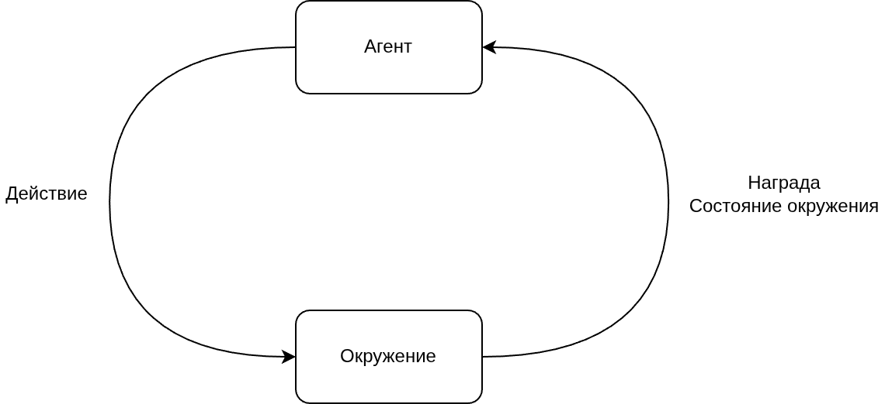
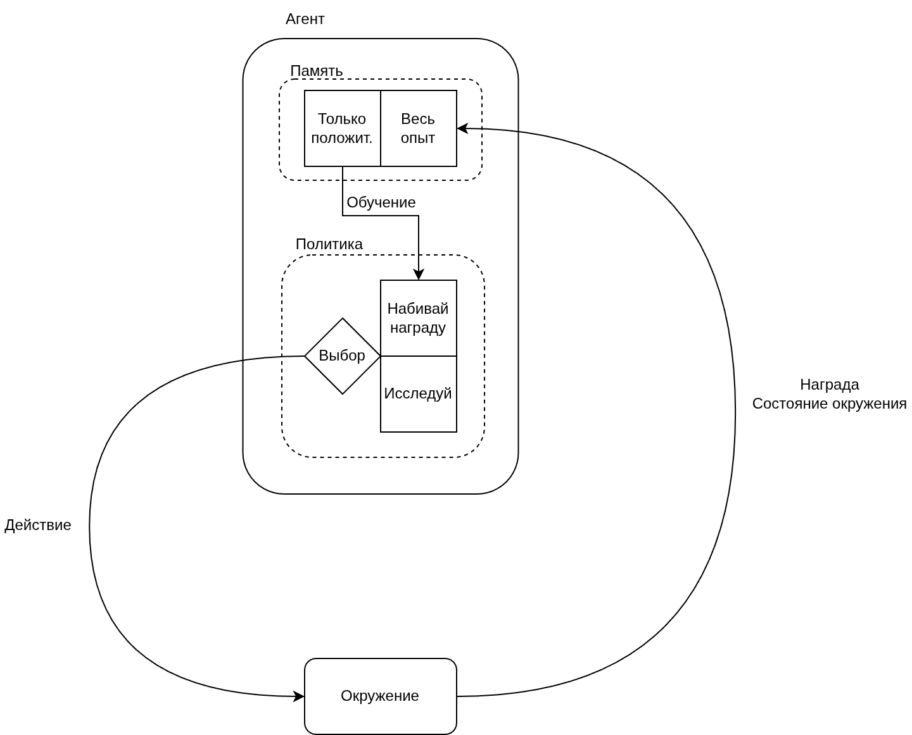

# Введение в обучение с подкреплением без глубокого погружения в математику.

Этот проект является частью статьи на (habr.com)[https://habr.com/ru/companies/cinimex/articles/1050296/]

## Стуруктура проекта

Директории:
```text
__target/           # сохраненные обученные модели, записи демонстрации работы модели
doc/                # текущая документация
src/                # исходный код проекта
```

Файлы:
```text
src/main.py         # исполняемый файл проекта
src/config.py       # конфигурация для исполняемого файла и проекта в целом
logging.conf        # настройки логирования
requirements.txt    # список используемых в проекте библиотек
```

## Концепт-схема обучения с подкреплением

Общая схема:



Детальная схема:
